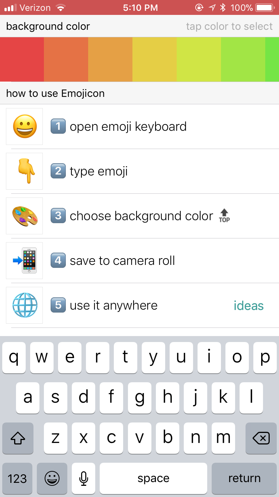
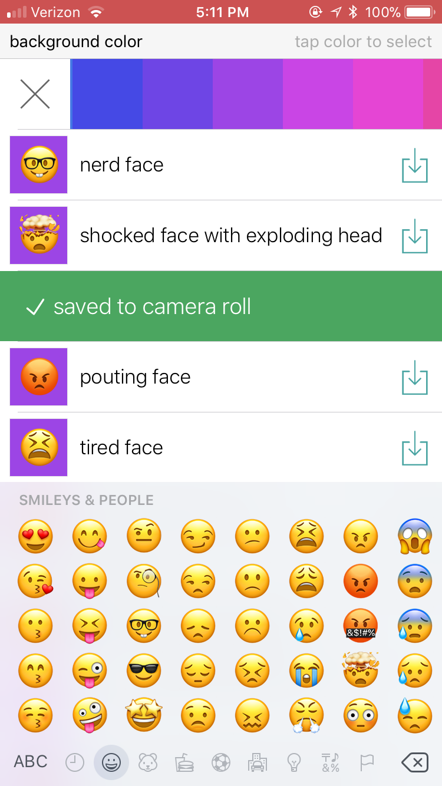
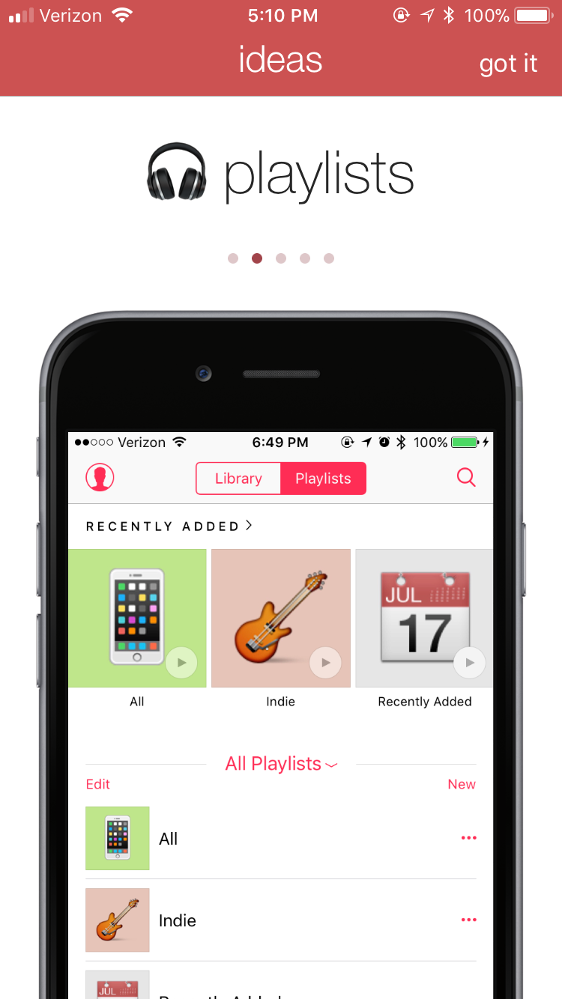

## Emojicon

Emojicon was my second app that I published on the App Store, back in April 2015. It was written in Swift 1 and lets you save images of emoji. This was especially useful for playlist icons for Apple Music. It was downloaded about 4500 times before I unlisted it in November 2017. 

Parts of this codebase were adapted into [Emoji Names](http://github.com/calda/Emoji-Names), which is still available on the App Store.

### Screenshots

      

 

### App Store marketing materials

      

